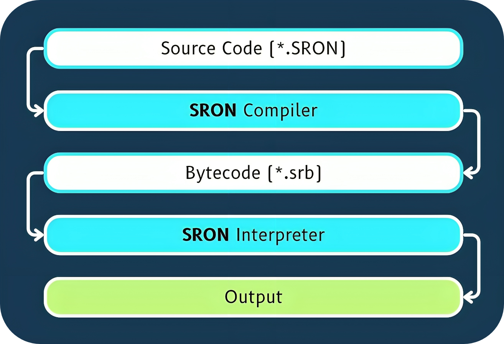

# SRON 
### **Current Stable Version:** 2.1
> **[Documentations](https://sron.gitbook.io/docs) | [Website](https://sronlang.github.io/)**

<figure><figcaption></figcaption></figure>

## What is SRON?

SRON (Saksham Rapid Object Notation) is a high-level, open-sourced programming language developed by Saksham Joshi. 

Combining the ease of Python, the stability of Java, and the speed and efficiency of C++, SRON offers a unique blend of features: Static + Dynamic typing, Garbage Collector, Return Value Optimization, Runtime Variable Management, Highly secured Bytecode, Abundant functions and a lot more.

Designed to provide developers with a blazingly fast and versatile coding experience with well written and easy to grasp documentations.

## How SRON works?

The compiler converts source code into SRON's bytecode, which is then saved to a ".srb" file. Subsequently, the SRON interpreter executes the bytecode file efficiently, offering high speed, reduced memory usage, and lower power consumption.

<figure><figcaption></figcaption></figure>

## How SRON is developed?

SRON is developed using the C++ programming language (GCC compiler). Both the compiler and interpreter feature a highly sophisticated architecture. The source code is available for review on [GitHub](https://github.com/saksham-joshi/SRON). 

The design and implementation of SRON took Saksham over a year to finalize, ensuring optimal performance and reliability. Detailed development logs documenting the entire journey of SRON's creation are available on [LinkedIn](https://www.linkedin.com/pulse/part-1-how-i-developed-sron-saksham-joshi-wqoac/), authored by Saksham Joshi.

The SRON's compiler converts the source code into a bytecode and saves it in a .srb file.
The main.srb file is further executed by SRON Interpreter.
