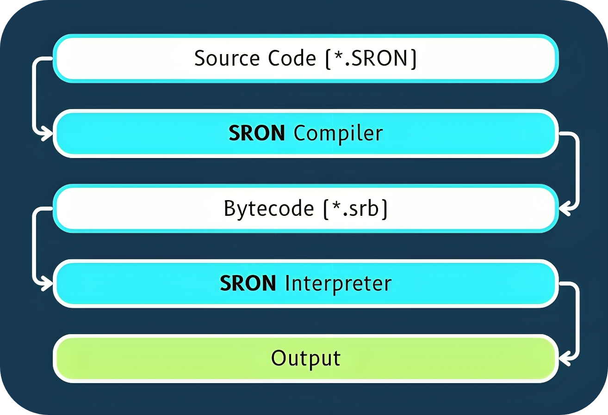

<div align="center">

# ⚡ SRON Programming Language

### Saksham Rapid Object Notation

**High-level • Static+Dynamic Typing • Functional • Blazingly Fast**

[](https://github.com/saksham-joshi/SRON/releases)
[](https://opensource.org/licenses/MPL-2.0)
[](LICENSE-PROPRIETARY.txt)
[]()

[](https://github.com/saksham-joshi/SRON)
[](https://github.com/saksham-joshi/SRON)
[](https://github.com/saksham-joshi/SRON)

[](https://marketplace.visualstudio.com/items?itemName=SAKSHAMJOSHI.SRON)

[📘 Documentation](https://sron.gitbook.io/docs) • [🌐 Official Website](https://sronlang.github.io/) • [📖 Learn More](#-what-is-sron)


</div>

---

## 🎯 What is SRON?

**SRON** (Saksham Rapid Object Notation) is a modern, open-source programming language that combines the best features of popular languages into one powerful tool.

### 🌟 Design Philosophy

```
Python's Ease + Java's Stability + C++'s Performance = SRON
```

SRON brings together:
- 🐍 The **simplicity and readability** of Python
- ☕ The **reliability and structure** of Java  
- ⚡ The **speed and efficiency** of C++

---

## ✨ Key Features

<table>
<tr>
<td width="50%">

### 🔧 Language Features
- **Hybrid Typing System** - Static + Dynamic typing
- **Automatic Memory Management** - Built-in garbage collector
- **Return Value Optimization** - Enhanced performance
- **Runtime Variable Management** - Flexible execution
- **Functional Programming** - Clean, composable code

</td>
<td width="50%">

### 🚀 Performance
- **Blazingly Fast Execution** - Optimized bytecode
- **Low Memory Footprint** - Efficient resource usage
- **Power Efficient** - Reduced CPU consumption
- **Secure Bytecode** - Highly protected compilation
- **Rich Standard Library** - Abundant built-in functions

</td>
</tr>
</table>

---

## 📊 Release History

| Version | Status | Release Date | Highlights |
|---------|--------|--------------|------------|
| 1.1 | ❌ Not Released | - | Initial development |
| 1.2 | ❌ Not Released | - | Unreleased prototype |
| 1.3 | ✅ Released | May 15, 2024 | First public release |
| 1.4 | ✅ Released | May 19, 2024 | Stability improvements |
| 1.5 | ✅ Released | May 22, 2024 | Performance enhancements |
| 2.1 | ✅ Released | December 3, 2024 | Major architecture update |
| 2.2 | ✅ Released | July 2, 2025 | C++23 migration |
| 2.3 | ✅ **Current Stable** | January 3, 2026 | Linux support, file I/O |

---

## ⚙️ How SRON Works

SRON uses a **hybrid compilation model** for optimal performance and security.


### 🔄 Two-Stage Process

1. **Compilation Phase**
   - Source code (`.sron`) → SRON Compiler
   - Generates optimized bytecode (`.srb`)
   - Validates syntax and semantics
   - Applies optimizations

2. **Execution Phase**
   - Bytecode (`.srb`) → SRON Interpreter
   - High-speed execution
   - Reduced memory usage
   - Lower power consumption

<div align="center">

</div>

---

## 🛠️ Development & Architecture

### Technology Stack

<div align="center">

| Component | Version ≤ 2.1 | Version ≥ 2.2 |
|-----------|---------------|---------------|
| **Language** | C++11 | C++23 |
| **Compiler** | GCC | Clang |
| **Architecture** | Vector-based | Vector-based (Enhanced) |

</div>


### 📝 Development Journey

The creation of SRON took **over a year** of dedicated development, focusing on:
- Performance optimization
- Reliability and stability
- Security measures
- User experience

Read the detailed development story on LinkedIn:  
👉 [Part 1: How I Developed SRON](https://www.linkedin.com/pulse/part-1-how-i-developed-sron-saksham-joshi-wqoac/) by Saksham Joshi

---

## 🤝 Contributing

We welcome contributions! While core security-critical components remain private, there are many ways to contribute:

- 🐛 Report bugs and issues
- 💡 Suggest new features
- 📖 Improve documentation
- 🧪 Write tests and examples
- 🌍 Help with translations

---

## 📄 Licensing

SRON is dual-licensed:

- **MPL-2.0** - For open-source components
- **Proprietary** - For closed-source security-critical parts

See [LICENSE](LICENSE) files for details.

---

## 👨‍💻 Creator

<div align="center">

### Saksham Joshi

**Software Enginneer • Open Source Enthusiast**

[](https://sakshamjoshi.vercel.app/)
[](https://www.linkedin.com/in/sakshamjoshi27)
[](https://github.com/saksham-joshi)
[](https://x.com/sakshamjoshi27)
[](mailto:social.sakshamjoshi@gmail.com)

</div>

---

## 🔗 Resources

- 📘 **[Official Documentation](https://sron.gitbook.io/docs)** - Complete language reference
- 🌐 **[Official Website](https://sronlang.github.io/)** - News, downloads, and updates
- 💬 **[Discussions](https://github.com/saksham-joshi/SRON/discussions)** - Community forum
- 🐛 **[Issue Tracker](https://github.com/saksham-joshi/SRON/issues)** - Report bugs
- 📦 **[Releases](https://github.com/saksham-joshi/SRON/releases)** - Download latest versions

---

<div align="center">

#### 🩵 Made with passion by [Saksham Joshi](https://github.com/saksham-joshi)

#### **© 2024-2026 Saksham Joshi • Creator of SRON Programming Language**

[sronlang.github.io](https://sronlang.github.io)

</div>