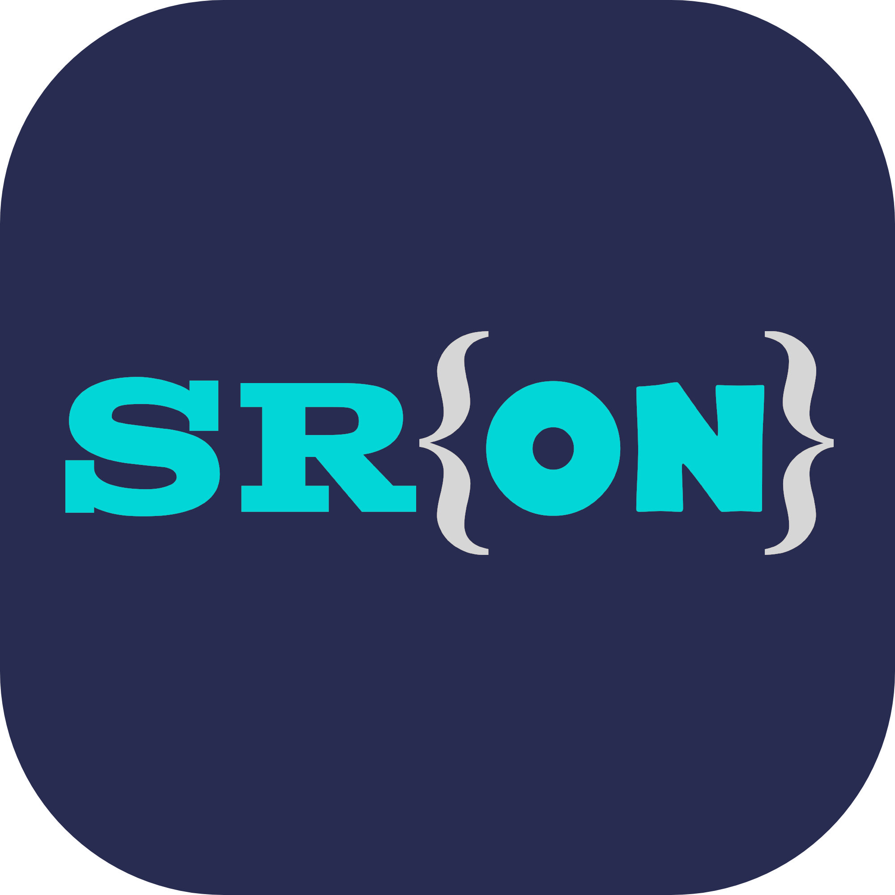

# SRON v2.1

    

## NOTE:

> ###  1. This code is completely open sourced and you are free to use it if you find it helpful.

> ###  2. Keep note that only BytecodeWriter of SRON's compiler and Execution Engine of SRON's interpreter are not open sourced due to some reasons.

> ### 3. This codebase is written in C++11 using GCC compiler.

> ### 4. I (Saksham Joshi) wrote this code when I have not enough knowledge about programming and compiler designing. So please don't cuss me. I am still learning.