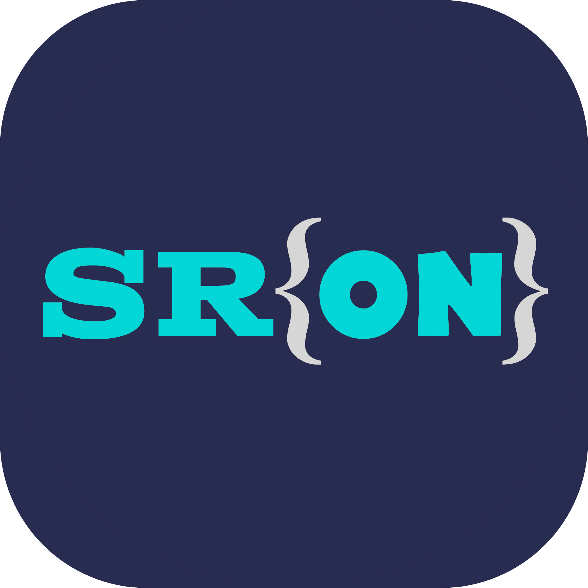

# SRON Language Support

**The official VS Code extension for the SRON programming language**
*Saksham Rapid Object Notation*

<!--  -->

---

## ✨ Features

### 🎨 Syntax Highlighting
Full grammar-based syntax highlighting tailored for `.sron` files — keywords, strings, comments, numbers, and more all beautifully colored.

### 💡Autocompletion
Smart suggestions for:
- **Built-in keywords** and control flow
- **Standard library functions**
- **User-defined variables** detected in the current file

### 📐 Code Formatter
Keep your SRON code clean and consistent with the built-in formatter. Trigger it anytime with:
- `Shift + Alt + F` (Windows / Linux)
- `Shift + Option + F` (macOS)

### ▶️ Run Button
Execute your SRON programs directly from VS Code — no terminal needed. A **Run** button appears in the editor title bar whenever you have a `.sron` file open.

### 🧩 Code Snippets
Handy snippets to speed up common patterns and boilerplate in SRON.

---

## 🚀 Getting Started

1. **Install** the extension from the [VS Code Marketplace](https://marketplace.visualstudio.com/items?itemName=saksham-joshi.sron).
2. **Open** any file with a `.sron` extension — syntax highlighting activates automatically.
3. **Start coding** and enjoy autocompletion, formatting, and the run button out of the box.

> **Prerequisite:** Make sure the SRON runtime is installed and available in your system `PATH` so the Run button can execute your programs.

---

## 📁 File Association

This extension automatically activates for files with the `.sron` extension and registers the **SRON** language mode within VS Code.

---

## 🐛 Issues & Feedback

Found a bug or have a feature request? Please open an issue on [GitHub](https://github.com/saksham-joshi/SRON) — all feedback is welcome!

---

## 👨‍💻 Developer

<table>
<tr>
<td align="center">

### Saksham Joshi

</td>
</tr>
</table>

---

**Made with 🩵 by [Saksham Joshi](https://github.com/saksham-joshi)**

*Designed for developers who love beautiful code* ✨

